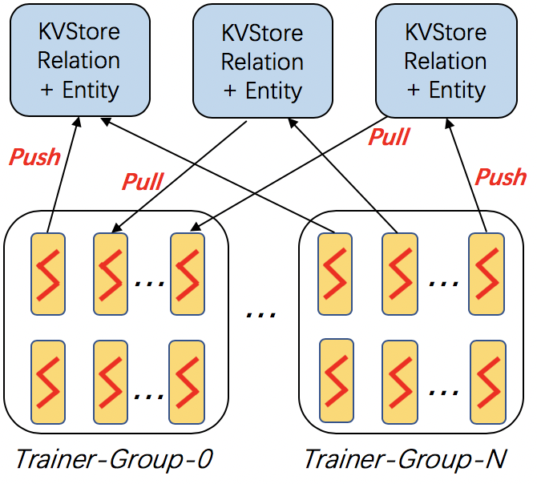

Distributed Training on Large Data
------------------------------------

``dglke_dist_train`` trains knowledge graph embeddings on a cluster of machines. DGL-KE adopts the *parameter-server* architecture for distributed training. 

In this architecture, the entity embeddings and relation embeddings are stored in DGL KVStore. The trainer processes pull the latest model from KVStore and push the calculated gradient to the KVStore to update the model. All the processes trains the KG embeddings with asynchronous SGD.

Arguments
^^^^^^^^^
The command line provides the following arguments:

  - ``--model_name {TransE, TransE_l1, TransE_l2, TransR, RESCAL, DistMult, ComplEx, RotatE}``
    The models provided by DGL-KE.

  - ``--data_path DATA_PATH``
    The path of the directory where DGL-KE loads knowledge graph data.

  - ``--dataset DATA_SET``
    The name of the knowledge graph stored under data_path. The knowledge graph should be generated by Partition script.

  - ``--format FORMAT``
    The format of the dataset. For builtin knowledge graphs,the foramt should be *built_in*. For users own knowledge graphs,it needs to be *raw_udd_{htr}* or *udd_{htr}*.

  - ``--save_path SAVE_PATH``
    The path of the directory where models and logs are saved.

  - ``--no_save_emb``
    Disable saving the embeddings under save_path.

  - ``--max_step MAX_STEP``   
    The maximal number of steps to train the model in a single process. A step trains the model with a batch of data. In the case of multiprocessing training, the total number of training steps is ``MAX_STEP`` * ``NUM_PROC``.

  - ``--batch_size BATCH_SIZE``
    The batch size for training.

  - ``--batch_size_eval BATCH_SIZE_EVAL``
    The batch size used for validation and test.

  - ``--neg_sample_size NEG_SAMPLE_SIZE``
    The number of negative samples we use for each positive sample in the training.

  - ``--neg_deg_sample``
    Construct negative samples proportional to vertex degree in the training. When this option is turned on, the number of negative samples per positive edge will be doubled. Half of the negative samples are generated uniformly whilethe other half are generated proportional to vertex degree.

  - ``--neg_deg_sample_eval``
    Construct negative samples proportional to vertex degree in the evaluation.

  - ``--neg_sample_size_eval NEG_SAMPLE_SIZE_EVAL``
    The number of negative samples we use to evaluate a positive sample.

  - ``--eval_percent EVAL_PERCENT``
    Randomly sample some percentage of edges for evaluation.

  - ``--no_eval_filter`` 
    Disable filter positive edges from randomly constructed negative edges for evaluation.

  - ``-log LOG_INTERVAL``
    Print runtime of different components every *x* steps.

  - ``--test``
    Evaluate the model on the test set after the model is trained.

  - ``--num_proc NUM_PROC`` 
    The number of processes to train the model in parallel.

  - ``--num_thread NUM_THREAD``
    The number of CPU threads to train the model in each process. This argument is used for multi-processing training.

  - ``--force_sync_interval FORCE_SYNC_INTERVAL``
    We force a synchronization between processes every *x* steps formultiprocessing training. This potentially stablizes the training processto get a better performance. For multiprocessing training, it is set to 1000 by default.

  - ``--hidden_dim HIDDEN_DIM``
    The embedding size of relation and entity.

  - ``--lr LR``          
    The learning rate. DGL-KE uses Adagrad to optimize the model parameters.

  - ``-g GAMMA`` or ``--gamma GAMMA``
    The margin value in the score function. It is used by *TransX* and *RotatE*.

  - ``-de`` or ``--double_ent``
    Double entitiy dim for complex number It is used by *RotatE*.

  - ``-dr`` or ``--double_rel``
    Double relation dim for complex number.

  - ``-adv`` or ``--neg_adversarial_sampling``
    Indicate whether to use negative adversarial sampling.It will weight negative samples with higher scores more.

  - ``-a ADVERSARIAL_TEMPERATURE`` or ``--adversarial_temperature ADVERSARIAL_TEMPERATURE``
    The temperature used for negative adversarial sampling.

  - ``-rc REGULARIZATION_COEF`` or ``--regularization_coef REGULARIZATION_COEF``
    The coefficient for regularization.

  - ``-rn REGULARIZATION_NORM`` or ``--regularization_norm REGULARIZATION_NORM``
    norm used in regularization.

  - ``--path PATH``
    Path of distributed workspace.

  - ``--ssh_key SSH_KEY``     
    ssh private key.

  - ``--ip_config IP_CONFIG``
    Path of IP configuration file.

  - ``--num_client_proc NUM_CLIENT_PROC``
    Number of worker processes on each machine.

The Steps for Distributed Training
^^^^^^^^^^^^^^^^^^^^^^^^^^^^^^^^^^

Distributed training on DGL-KE usually involves three steps:

  1. Partition a knowledge graph.
  2. Copy partitioned data to remote machines.
  3. Invoke the distributed training job by ``dglke_dist_train``.

Here we demonstrate how to training KG embedding on ``FB15k`` dataset using 4 machines. Note that, the ``FB15k`` is just a small dataset as our toy demo. An interested user can try it on ``Freebase``, which contains *86M* nodes and *338M* edges.

**Step 1: Prepare your machines**

Assume that we have four machines with the following IP addresses::

    machine_0: 172.31.24.245
    machine_1: 172.31.24.246
    machine_2: 172.31.24.247
    machine_3: 172.32.24.248

Make sure that *machine_0* has the permission to *ssh* to all the other machines. 

**Step 2: Prepare your data**

Create a new directory called ``my_task`` on machine_0::

    mkdir my_task

We use built-in ``FB15k`` as demo and paritition it into ``4`` parts::

    dglke_partition --dataset FB15k -k 4 --data_path ~/my_task

Note that, in this demo, we have 4 machines so we set ``-k`` to 4. After this step, we can see 4 new directories called ``partition_0``, ``partition_1``, ``partition_2``, and ``partition_3`` in your ``FB15k`` dataset folder.

Create a new file called ``ip_config.txt`` in ``my_task``, and write the following contents into it::

    172.31.24.245 30050 8
    172.31.24.246 30050 8
    172.31.24.247 30050 8
    172.32.24.248 30050 8

Each line in ``ip_config.txt`` is the KVStore configuration on each machine. For example, ``172.31.24.245 30050 8`` represents that, on ``machine_0``, the IP is ``172.31.24.245``, the base port is ``30050``, and we start ``8`` servers on this machine. Note that, you can change the number of servers on each machine based on your machine capabilities. In our environment, the instance has ``48`` cores, and we set ``8`` cores to KVStore and ``40`` cores for worker processes.

After that, we can copy the ``my_task`` directory to all the remote machines::

    scp -r ~/my_task 172.31.24.246:~
    scp -r ~/my_task 172.31.24.247:~
    scp -r ~/my_task 172.31.24.248:~

**Step 3: Launch distributed jobs**

Run the following command on ``machine_0`` to start a distributed task::

    dglke_dist_train --path ~/my_task --ip_config ~/my_task/ip_config.txt \
    --num_client_proc 16 --model_name TransE_l2 --dataset FB15k --data_path ~/my_task --hidden_dim 400 \
    --gamma 19.9 --lr 0.25 --batch_size 1000 --neg_sample_size 200 --max_step 500 --log_interval 100 \
    --batch_size_eval 16 --test -adv --regularization_coef 1.00E-09 --num_thread 1

Most of the options we have already seen in previous sections. Here are some new options we need to know. 

``--path`` indicates the absolute path of our workspace. All the logs and trained embedding will be stored in this path.

``--ip_config`` is the absolute path of ``ip_config.txt``.

``--num_client_proc`` has the same behaviors to ``--num_proc`` in single-machine training.

All the other options are the same as single-machine training. For some EC2 users, you can also set ``--ssh_key`` for right *ssh* permission.

If you don't set ``--no_save_embed`` option. The trained KG embeddings will be stored in ``machine_0/my_task/ckpts`` by default.
