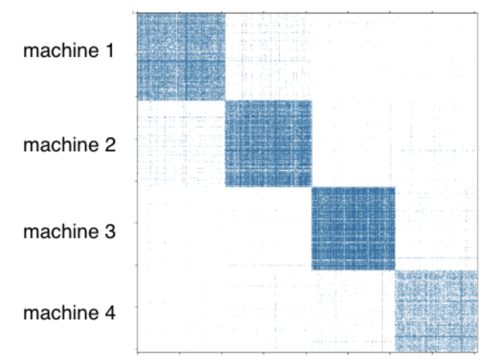

Partition a Knowledge Graph
===========================

For distributed training, a user needs to partition a graph beforehand. DGL-KE provides a partition tool ``dglke_partition``, which partitions a given knowledge graph into ``N`` parts with `the METIS partition algorithm`__. This partition algorithm reduces the number of edge cuts between partitions to reduce network communication in the distributed training. For a cluster of ``P`` machines, we usually split a graph into ``P`` partitions and assign a partition to a machine as shown in the figure below.

.. __: http://glaros.dtc.umn.edu/gkhome/metis/metis/overview

Arguments
---------
The command line provides the following arguments:

  - ``--data_path DATA_PATH``
    The name of the knowledge graph stored under data_path. If it is one ofthe builtin knowledge grpahs such as FB15k, DGL-KE will automatically download the knowledge graph and keep it under data_path.

  - ``--dataset DATA_SET``
    The name of the knowledge graph stored under data_path. If it is one of the builtin knowledge grpahs such as ``FB15k``, ``FB15k-237``, ``wn18``, ``wn18rr``, and ``Freebase``, DGL-KE will automatically download the knowledge graph and keep it under data_path.

  - ``--format FORMAT``
    The format of the dataset. For builtin knowledge graphs, the format is determined automatically. For users own knowledge graphs, it needs to be ``raw_udd_{htr}`` or ``udd_{htr}``. ``raw_udd_`` indicates that the user's data use **raw ID** for entities and relations and ``udd_`` indicates that the user's data uses **KGE ID**. ``{htr}`` indicates the location of the head entity, tail entity and relation in a triplet. For example, ``htr`` means the head entity is the first element in the triplet, the tail entity is the second element and the relation is the last element.

  - ``--data_files [DATA_FILES ...]``
    A list of data file names. This is required for training KGE on their own datasets. If the format is ``raw_udd_{htr}``, users need to provide *train_file* [*valid_file*] [*test_file*]. If the format is ``udd_{htr}``, users need to provide *entity_file* *relation_file* *train_file* [*valid_file*] [*test_file*]. In both cases, *valid_file* and *test_file* are optional.

  - ``--delimiter DELIMITER``
    Delimiter used in data files. Note all files should use the same delimiter.

  - ``-k NUM_PARTS`` or ``--num-parts NUM_PARTS``
    The number of partitions.
