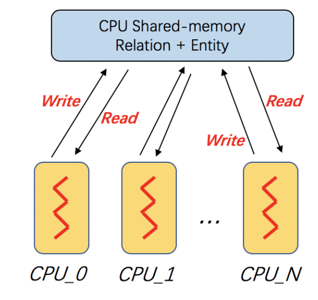
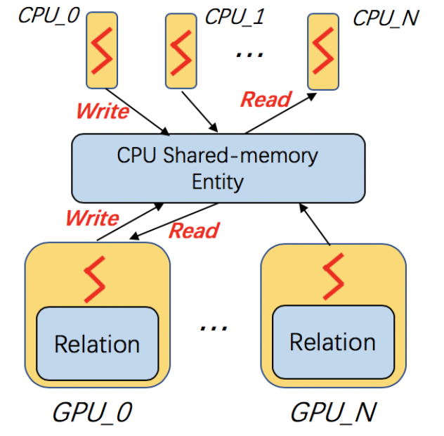

Training in a single machine
============================

``dglke_train`` trains KG embeddings on CPUs or GPUs in a single machine and saves the trained node embeddings and relation embeddings on disks.

Arguments
^^^^^^^^^
The command line provides the following arguments:

  - ``--model_name {TransE, TransE_l1, TransE_l2, TransR, RESCAL, DistMult, ComplEx, RotatE, SimplE}``
    The models provided by DGL-KE.

  - ``--data_path DATA_PATH``
    The path of the directory where DGL-KE loads knowledge graph data.

  - ``--dataset DATA_SET``
    The name of the knowledge graph stored under data_path. If it is one of the builtin knowledge grpahs such as ``FB15k``, ``FB15k-237``, ``wn18``, ``wn18rr``, and ``Freebase``, DGL-KE will automatically download the knowledge graph and keep it under data_path.

  - ``--format FORMAT``
    The format of the dataset. For builtin knowledge graphs, the format is determined automatically. For users own knowledge graphs, it needs to be ``raw_udd_{htr}`` or ``udd_{htr}``. ``raw_udd_`` indicates that the user's data use **raw ID** for entities and relations and ``udd_`` indicates that the user's data uses **KGE ID**. ``{htr}`` indicates the location of the head entity, tail entity and relation in a triplet. For example, ``htr`` means the head entity is the first element in the triplet, the tail entity is the second element and the relation is the last element.

  - ``--data_files [DATA_FILES ...]``
    A list of data file names. This is required for training KGE on their own datasets. If the format is ``raw_udd_{htr}``, users need to provide *train_file* [*valid_file*] [*test_file*]. If the format is ``udd_{htr}``, users need to provide *entity_file* *relation_file* *train_file* [*valid_file*] [*test_file*]. In both cases, *valid_file* and *test_file* are optional.

  - ``--delimiter DELIMITER``
    Delimiter used in data files. Note all files should use the same delimiter.

  - ``--save_path SAVE_PATH``
    The path of the directory where models and logs are saved.

  - ``--no_save_emb``
    Disable saving the embeddings under save_path.

  - ``--max_step MAX_STEP``
    The maximal number of steps to train the model in a single process. A step trains the model with a batch of data. In the case of multiprocessing training, the total number of training steps is ``MAX_STEP`` * ``NUM_PROC``.

  - ``--batch_size BATCH_SIZE``
    The batch size for training.

  - ``--batch_size_eval BATCH_SIZE_EVAL``
    The batch size used for validation and test.

  - ``--neg_sample_size NEG_SAMPLE_SIZE``
    The number of negative samples we use for each positive sample in the training.

  - ``--neg_deg_sample``
    Construct negative samples proportional to vertex degree in the training. When this option is turned on, the number of negative samples per positive edge will be doubled. Half of the negative samples are generated uniformly whilethe other half are generated proportional to vertex degree.

  - ``--neg_deg_sample_eval``
    Construct negative samples proportional to vertex degree in the evaluation.

  - ``--neg_sample_size_eval NEG_SAMPLE_SIZE_EVAL``
    The number of negative samples we use to evaluate a positive sample.

  - ``--eval_percent EVAL_PERCENT``
    Randomly sample some percentage of edges for evaluation.

  - ``--no_eval_filter``
    Disable filter positive edges from randomly constructed negative edges for evaluation.

  - ``-log LOG_INTERVAL``
    Print runtime of different components every ``LOG_INTERVAL`` steps.

  - ``--eval_interval EVAL_INTERVAL``
    Print evaluation results on the validation dataset every ``EVAL_INTERVAL`` steps if validation is turned on.

  - ``--test``
    Evaluate the model on the test set after the model is trained.

  - ``--num_proc NUM_PROC``
    The number of processes to train the model in parallel. In multi-GPU training, the number of processes by default is the number of GPUs. If it is specified explicitly, the number of processes needs to be divisible by the number of GPUs.

  - ``--num_thread NUM_THREAD``
    The number of CPU threads to train the model in each process. This argument is used for multi-processing training.

  - ``--force_sync_interval FORCE_SYNC_INTERVAL``
    We force a synchronization between processes every ``FORCE_SYNC_INTERVAL`` steps for multiprocessing training. This potentially stablizes the training process to get a better performance. For multiprocessing training, it is set to 1000 by default.

  - ``--hidden_dim HIDDEN_DIM``
    The embedding size of relations and entities.

  - ``--lr LR``
    The learning rate. DGL-KE uses Adagrad to optimize the model parameters.

  - ``-g GAMMA`` or ``--gamma GAMMA``
    The margin value in the score function. It is used by *TransX* and *RotatE*.

  - ``-de`` or ``--double_ent``
    Double entitiy dim for complex number or canonical polyadic. It is used by *RotatE* and *SimplE*.

  - ``-dr`` or ``--double_rel``
    Double relation dim for complex number or canonical polyadic.

  - ``-adv`` or ``--neg_adversarial_sampling``
    Indicate whether to use negative adversarial sampling.It will weight negative samples with higher scores more.

  - ``-a ADVERSARIAL_TEMPERATURE`` or ``--adversarial_temperature ADVERSARIAL_TEMPERATURE``
    The temperature used for negative adversarial sampling.

  - ``-rc REGULARIZATION_COEF`` or ``--regularization_coef REGULARIZATION_COEF``
    The coefficient for regularization.

  - ``-rn REGULARIZATION_NORM`` or ``--regularization_norm REGULARIZATION_NORM``
    norm used in regularization.

  - ``--gpu [GPU ...]``
    A list of gpu ids, e.g. 0 1 2 4

  - ``--mix_cpu_gpu``
    Training a knowledge graph embedding model with both CPUs and GPUs.The embeddings are stored in CPU memory and the training is performed in GPUs.This is usually used for training large knowledge graph embeddings.

  - ``--valid``
    Evaluate the model on the validation set in the training.

  - ``--rel_part``
    Enable relation partitioning for multi-GPU training.

  - ``--async_update``
    Allow asynchronous update on node embedding for multi-GPU training. This overlaps CPU and GPU computation to speed up.

  - ``--has_edge_importance``
    Allow providing edge importance score for each edge during training. The positive score and negative scores will be adjusted as score = score * edge_importance.

  - ``--loss_genre {Logistic, Hinge, Logsigmoid, BCE}``
    The loss functions provided by DGL-KE. Default loss is Logsigmoid

  - ``--margin`` or ``-m``
    The margin value for hinge loss.

  - ``-pw`` or ``--pairwise``
    Use relative loss between positive score and negative score. Note only Logistic, Hinge support pairwise loss.

Training on Multi-Core
^^^^^^^^^^^^^^^^^^^^^^^

Multi-core processors are very common and widely used in modern computer architecture. DGL-KE is optimized on multi-core processors. In DGL-KE, we uses multi-processes instead of multi-threads for parallel training. In this design, the enity embeddings and relation embeddings will be stored in a global shared-memory and all the trainer processes can read and write it. All the processes will train the global model in a *Hogwild* style.

The following command trains the ``transE`` model on ``FB15k`` dataset on a multi-core machine. Note that, the total number of steps to train the model in this case is ``24000``::

  dglke_train --model_name TransE_l2 --dataset FB15k --batch_size 1000 --neg_sample_size 200 --hidden_dim 400 \
  --gamma 19.9 --lr 0.25 --max_step 3000 --log_interval 100 --batch_size_eval 16 --test -adv \
  --regularization_coef 1.00E-09 --num_thread 1 --num_proc 8

After training, you will see the following messages::

    -------------- Test result --------------
    Test average MRR : 0.6520483281422476
    Test average MR : 43.725415178344704
    Test average HITS@1 : 0.5257063533713666
    Test average HITS@3 : 0.7524081190431853
    Test average HITS@10 : 0.8479202993008413
    -----------------------------------------

Training on single GPU
^^^^^^^^^^^^^^^^^^^^^^^

Training knowledge graph embeddings requires a large number of tensor computation, which can be accelerated by GPU. DGL-KE can run on a single GPU, as well as a multi-GPU machine. Also, it can run in a *mix-gpu-cpu* setting, where the embedding data cannot fit in GPU memory.

The following command trains the ``transE`` model on ``FB15k`` on a single GPU::

    dglke_train --model_name TransE_l2 --dataset FB15k --batch_size 1000 --log_interval 100 \
    --neg_sample_size 200 --regularization_coef=1e-9 --hidden_dim 400 --gamma 19.9 \
    --lr 0.25 --batch_size_eval 16 --test -adv --gpu 0 --max_step 24000

Most of the options here we have already seen in the previous section. The only difference is that we add ``--gpu 0`` to indicate that we will use 1 GPU to train our model. Compared to the cpu training, every 100 steps only takes ``0.72`` seconds on the Nvidia v100 GPU, which is much faster than ``8.9`` second in CPU training::

  [proc 0]sample: 0.165, forward: 0.282, backward: 0.217, update: 0.087
  [proc 0][Train](1900/24000) average pos_loss: 0.32798981070518496
  [proc 0][Train](1900/24000) average neg_loss: 0.45353577584028243
  [proc 0][Train](1900/24000) average loss: 0.3907627931237221
  [proc 0][Train](1900/24000) average regularization: 0.0012039361777715384
  [proc 0][Train] 100 steps take 0.726 seconds
  [proc 0]sample: 0.137, forward: 0.282, backward: 0.218, update: 0.087
  [proc 0][Train](2000/24000) average pos_loss: 0.31407852172851564
  [proc 0][Train](2000/24000) average neg_loss: 0.44177248477935793
  [proc 0][Train](2000/24000) average loss: 0.3779255014657974
  [proc 0][Train](2000/24000) average regularization: 0.0012163800827693194
  [proc 0][Train] 100 steps take 0.760 seconds
  [proc 0]sample: 0.171, forward: 0.282, backward: 0.218, update: 0.087
  [proc 0][Train](2100/24000) average pos_loss: 0.309254549741745
  [proc 0][Train](2100/24000) average neg_loss: 0.43288875490427015
  [proc 0][Train](2100/24000) average loss: 0.37107165187597274
  [proc 0][Train](2100/24000) average regularization: 0.0012251652684062719
  [proc 0][Train] 100 steps take 0.726 seconds
  [proc 0]sample: 0.136, forward: 0.283, backward: 0.219, update: 0.087
  [proc 0][Train](2200/24000) average pos_loss: 0.3109792047739029
  [proc 0][Train](2200/24000) average neg_loss: 0.4351910164952278
  [proc 0][Train](2200/24000) average loss: 0.3730851110816002
  [proc 0][Train](2200/24000) average regularization: 0.0012286945607047528
  [proc 0][Train] 100 steps take 0.732 seconds

Mix CPU-GPU training
^^^^^^^^^^^^^^^^^^^^^

By default, DGL-KE keeps all node and relation embeddings in GPU memory for single-GPU training. It cannot train embeddings of large knowledge graphs because the capacity of GPU memory typically is much smaller than the CPU memory. So if your KG embedding is too large to fit in the GPU memory, you can use the *mix_cpu_gpu* training::

    dglke_train --model_name TransE_l2 --dataset FB15k --batch_size 1000 --log_interval 100 \
    --neg_sample_size 200 --regularization_coef=1e-9 --hidden_dim 400 --gamma 19.9 \
    --lr 0.25 --batch_size_eval 16 --test -adv --gpu 0 --max_step 24000 --mix_cpu_gpu

The *mix_cpu_gpu* training keeps node and relation embeddings in CPU memory and performs batch computation in GPU. In this way, you can train very large KG embeddings as long as your cpu memory can handle it even though the training speed of *mix_cpu_gpu* training is slower than pure GPU training::

   [proc 0][Train](8200/24000) average pos_loss: 0.2720812517404556
   [proc 0][Train](8200/24000) average neg_loss: 0.4004567116498947
   [proc 0][Train](8200/24000) average loss: 0.3362689846754074
   [proc 0][Train](8200/24000) average regularization: 0.0014934110222384334
   [proc 0][Train] 100 steps take 0.958 seconds
   [proc 0]sample: 0.133, forward: 0.339, backward: 0.185, update: 0.301
   [proc 0][Train](8300/24000) average pos_loss: 0.27434037417173385
   [proc 0][Train](8300/24000) average neg_loss: 0.40289842933416364
   [proc 0][Train](8300/24000) average loss: 0.33861940175294875
   [proc 0][Train](8300/24000) average regularization: 0.001497904829448089
   [proc 0][Train] 100 steps take 0.970 seconds
   [proc 0]sample: 0.145, forward: 0.339, backward: 0.185, update: 0.300
   [proc 0][Train](8400/24000) average pos_loss: 0.27482498317956927
   [proc 0][Train](8400/24000) average neg_loss: 0.40262984931468965
   [proc 0][Train](8400/24000) average loss: 0.3387274172902107
   [proc 0][Train](8400/24000) average regularization: 0.0015005254035349936
   [proc 0][Train] 100 steps take 0.958 seconds
   [proc 0]sample: 0.132, forward: 0.338, backward: 0.185, update: 0.301

As we can see, the *mix_cpu_gpu* training takes ``0.95`` seconds on every 100 steps. It is slower than pure GPU training (``0.73``) but still much faster than CPU (``8.9``).

Users can speed up the *mix_cpu_gpu* training by using ``--async_update`` option. When using this option, the GPU device will not wait for the CPU to finish its job when it performs update operation::

    dglke_train --model_name TransE_l2 --dataset FB15k --batch_size 1000 --log_interval 100 \
    --neg_sample_size 200 --regularization_coef=1e-9 --hidden_dim 400 --gamma 19.9 \
    --lr 0.25 --batch_size_eval 16 --test -adv --gpu 0 --max_step 24000 --mix_cpu_gpu --async_update

We can see that the training time goes down from ``0.95`` to ``0.84`` seconds on every 100 steps::

  [proc 0][Train](22500/24000) average pos_loss: 0.2683987358212471
  [proc 0][Train](22500/24000) average neg_loss: 0.3919999450445175
  [proc 0][Train](22500/24000) average loss: 0.33019934087991715
  [proc 0][Train](22500/24000) average regularization: 0.0017611468932591378
  [proc 0][Train] 100 steps take 0.842 seconds
  [proc 0]sample: 0.161, forward: 0.381, backward: 0.200, update: 0.099
  [proc 0][Train](22600/24000) average pos_loss: 0.2682730385661125
  [proc 0][Train](22600/24000) average neg_loss: 0.39290413081645964
  [proc 0][Train](22600/24000) average loss: 0.3305885857343674
  [proc 0][Train](22600/24000) average regularization: 0.0017612565110903234
  [proc 0][Train] 100 steps take 0.838 seconds
  [proc 0]sample: 0.159, forward: 0.379, backward: 0.200, update: 0.098
  [proc 0][Train](22700/24000) average pos_loss: 0.2688949206471443
  [proc 0][Train](22700/24000) average neg_loss: 0.3927029174566269
  [proc 0][Train](22700/24000) average loss: 0.33079892098903657
  [proc 0][Train](22700/24000) average regularization: 0.0017607113404665142
  [proc 0][Train] 100 steps take 0.859 seconds

Training on Multi-GPU
^^^^^^^^^^^^^^^^^^^^^^^

DGL-KE also supports multi-GPU training to accelerate training. The following figure depicts 4 GPUs on a single machine and connected to the CPU through a PCIe switch. Multi-GPU training automatically keeps node and relation embeddings on CPUs and dispatch batches to different GPUs.

.. image:: ../images/multi-gpu.svg
    :width: 200

The following command shows how to training our ``transE`` model using 4 Nvidia v100 GPUs jointly::

    dglke_train --model_name TransE_l2 --dataset FB15k --batch_size 1000 --log_interval 1000 \
    --neg_sample_size 200 --regularization_coef=1e-9 --hidden_dim 400 --gamma 19.9 \
    --lr 0.25 --batch_size_eval 16 --test -adv --gpu 0 1 2 3 --max_step 6000 --async_update

Compared to single-GPU training, we change ``--gpu 0`` to ``--gpu 0 1 2 3``, and also we change ``--max_step`` from ``24000`` to ``6000``::

  [proc 0][Train](5800/6000) average pos_loss: 0.2675808426737785
  [proc 0][Train](5800/6000) average neg_loss: 0.3915132364630699
  [proc 0][Train](5800/6000) average loss: 0.3295470401644707
  [proc 0][Train](5800/6000) average regularization: 0.0017635633377358318
  [proc 0][Train] 100 steps take 1.123 seconds
  [proc 0]sample: 0.237, forward: 0.472, backward: 0.215, update: 0.198
  [proc 3][Train](5800/6000) average pos_loss: 0.26807423621416093
  [proc 3][Train](5800/6000) average neg_loss: 0.3898271417617798
  [proc 3][Train](5800/6000) average loss: 0.32895069003105165
  [proc 3][Train](5800/6000) average regularization: 0.0017631534475367515
  [proc 3][Train] 100 steps take 1.157 seconds
  [proc 3]sample: 0.248, forward: 0.489, backward: 0.217, update: 0.202
  [proc 1][Train](5900/6000) average pos_loss: 0.267591707110405
  [proc 1][Train](5900/6000) average neg_loss: 0.3929813900589943
  [proc 1][Train](5900/6000) average loss: 0.3302865487337112
  [proc 1][Train](5900/6000) average regularization: 0.0017678673949558287
  [proc 1][Train] 100 steps take 1.140 seconds

As we can see, using 4 GPUs we have almost *3x* end-to-end performance speedup.

Note that ``--async_update`` can increase system performance but it could also slow down the model convergence. So DGL-KE provides another option called ``--force_sync_interval`` that forces all GPU sync their model on every ``N`` steps. For example, the following command will sync model across GPUs on every 1000 steps::

    dglke_train --model_name TransE_l2 --dataset FB15k --batch_size 1000 --log_interval 1000 \
    --neg_sample_size 200 --regularization_coef=1e-9 --hidden_dim 400 --gamma 19.9 \
    --lr 0.25 --batch_size_eval 16 --test -adv --gpu 0 1 2 3 --async_update --max_step 6000 --force_sync_interval 1000

Save embeddings
^^^^^^^^^^^^^^^

By default, ``dglke_train`` saves the embeddings in the ``ckpts`` folder. Each run creates a new folder in ``ckpts`` to store the training results. The new folder is named after ``xxxx_yyyy_zz``\ , where ``xxxx`` is the model name, ``yyyy`` is the dataset name, ``zz`` is a sequence number that ensures a unique name for each run.

The saved embeddings are stored as numpy ndarrays. The node embedding is saved as ``XXX_YYY_entity.npy``.
The relation embedding is saved as ``XXX_YYY_relation.npy``. ``XXX`` is the dataset name and ``YYY`` is the model name.

A user can disable saving embeddings with ``--no_save_emb``. This might be useful for some cases, such as hyperparameter tuning.
